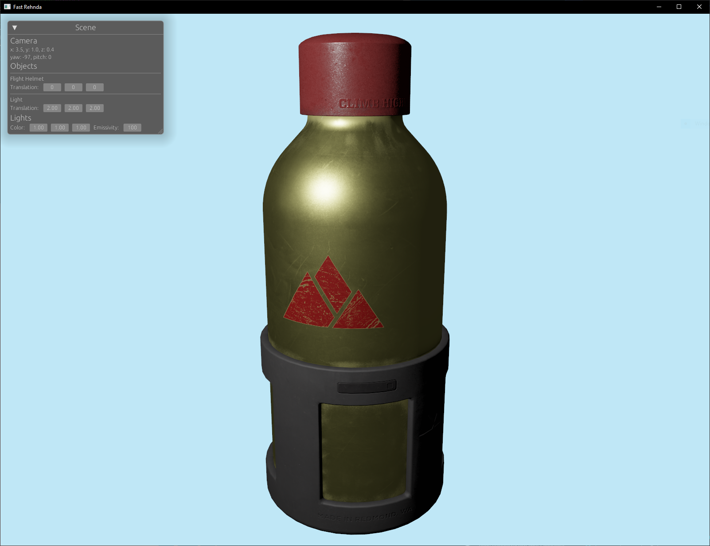

# Fast Rehnda

A vulkan renderer built with rust as a learning project.

Current features:

- GLTF object loading
  - Supports texturing, metallic, roughness, emissive
- ECS based resource management
- PBR shaders
- Image based lighting for environment lighting
- Immediate mode debug UI
- Multi-sampling
- Supports multiple shaders (e.g. flat shading and PBR in the same scene)

## Screenshots

### Image based Lighting

### PBR rendering

### Mutli-sampling

